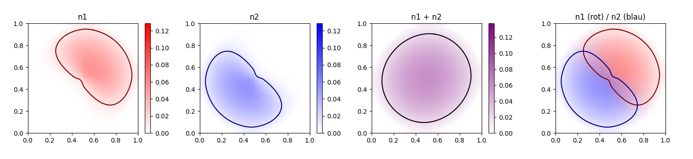
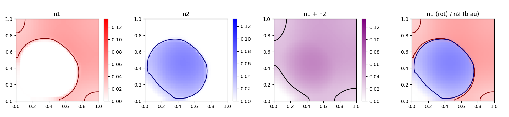
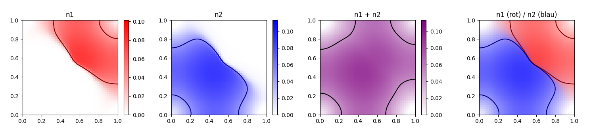

# Implementation of a 2D, two species tissue growth model in Python using finite-volumes

## Overview

This project implements a two-dimensional tissue growth model based on the work of Tomasz Debiec, Mainak Mandal and Markus Schmidtchen presented in *From finite to continuous phenotypes in (visco-)elastic tissue growth models*.

The simulation considers two competing cell populations whose dynamics are governed by pressure-driven motion, growth and competition. The model was implemented in Python as part of a scientific computing project during my B.Sc. studies in Mathematics in Business and Economics at TU Dresden.

## Mathematical model (PDE)

The model describes the evolution of two competing cell populations in space and time and is governed by the following system:

$$
\frac{\partial n^{(i)} }{\partial t} = \nabla \cdot \left( n^{(i)} \nabla \underline n \right) + n^{(i)} G^{(i)}(\underline n) .
$$

Changes in local cell density arise from:

* **Pressure-driven movement** of cells
* **Cell proliferation** (growth)
* **Competition** between species

In addition to the original model, a gradient-independent self-diffusion term was introduced to study its influence on population dynamics.

## Numerical method

* **Spatial Discretization:** A finite-volume method with upwind fluxes was used on a normalized 2D grid. Pressure-driven transport is computed through flux balances across control-volume interfaces.
* **Time Integration:** Performed using an explicit Euler scheme.
* **Boundary Conditions:** Both Neumann and Dirichlet boundary conditions are supported.

## Results

The simulations demonstrate how growth rates, competition coefficients, diffusion parameters and initial conditions affect the long-term behaviour of the two populations.

Depending on the parameter configuration, the model exhibits coexistence, competitive exclusion or spatial segregation of the species.

Several representative simulation results are included below.

### Gallery

**Standard simulation**

**Red diffuses faster**

**Red is less competitive**

## How to test it yourself
1) `pip install numpy matplotlib scikit-image`.
2) Import the simulation `import tissue_growth_model`.
3) Create a simulation object with `sim = TissueSim2D(...)`.
4) Run the simulation with `sim.run()`.
5) Visualize the simulation with `sim.visualize()`.
6) Save and load with `sim.save()` and `sim.load()`.

## References
* Debiec, T., Mandal, M., & Schmidtchen, M. — [*From finite to continuous phenotypes in (visco-)elastic tissue growth models.*](https://www.sciencedirect.com/science/article/pii/S0022039625004024)